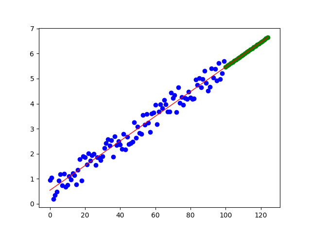

# sibyl

sibyl, the prophet of the ancient Greeks. :)

It is the Predix analytic demo for linear regression.

## release

Get Predix analytics framework compatible [**zip file**](https://github.com/pxie/sibyl/raw/master/release/sibyl.release.zip) from release folder

## setup local dev env

1. `git clone https://github.com/pxie/sibyl.git`
2. `cd sibyl`
3. `pip install -r requirements.txt`

## test

1. `cd sibyl`
2. `python tests/tests.py`
3. the following linear regression chart will be presented

